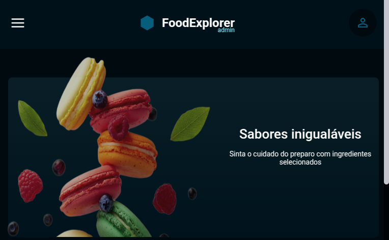

<h1 align = "center">
  
</h1>

## Sobre o projeto

O projeto final Rocketseat FoodExplorer é uma aplicação web desenvolvida para um restaurante fictício. Nela, todos os usuários devem ter a capacidade de se cadastrar na página e realizar o seu Login. Caso o usuário seja um ***admin***, ele terá a capacidade de, além de visualizar os pratos já cadastrados, criar novos e editá-los. Caso o usuário autenticado seja um ***customer***, ele terá a capacidade de, apenas, visualizar os pratos já cadastrados pelo ***admin*** da aplicação. Há, na aplicação, um menu lateral interativo ao lado esquerdo da página que possui uma barra de pesquisa, em que é possível filtrar os pratos cadastrados por nome e pelos seus ingredientes, e um botão (visível apenas ao usuário ***admin***), que o redireciona à página em que é possível criar os pratos novos para a aplicação. Além disso, todos os usuários podem alterar suas informações de perfil (avatar, nome, e-mail e senha) ao clicar no ícone de perfil no canto superior direito da tela. Por fim, a aplicação em questão foi construída com telas responsivas a diversos aparelhos (mobile e desktop) para melhorar a experiência do usuário.

## Como utilizar o projeto

### Versão admin da aplicação

```bash

  # E-mail: felipe@admin.com
  # senha: 123

```

### Versão customer (usuário comum) da aplicação

```bash

  # E-mail: joao@email.com
  # senha: 123456

```
 
### Executando o Frontend do projeto

```bash

  # Vá até o diretório do projeto
  $ cd FoodExplorer

  # Instale a dependência node_modules
  $ npm install

  # Inicie o servidor 
  $ npm run dev

  # Agora, basta executar cntrl + click no endereço exibido no terminal ou digitar no seu navegador de preferência:
  $ http://localhost:5173/

```

## Tecnologias utilizadas

A parte Frontend do projeto foi desenvolvida com a utilização das seguintes tecnologias:

- [ReactJS](https://react.dev/)
- [JavaScript]()
- [ReactDOM](https://www.npmjs.com/package/react-dom)
- [React Router DOM](https://www.npmjs.com/package/react-router-dom)
- [Axios](https://www.npmjs.com/package/axios)
- [React Icons](https://react-icons.github.io/react-icons/)
- [Styled Components](https://styled-components.com/)
- [Swiper](https://swiperjs.com/react)

### - ReactJS 

Biblioteca JavaScript voltada ao frontend e amplamente utilizada para o desenvolvimento de interfaces de usuário (UIs).

### - JavaScript

Linguagem de programação de tipagem fraca (não exige que o tipo de uma variável ou função seja declarado quando ela é criada) amplamente utilizada para a criação de páginas Web. Pode ser utilizada tanto no frontend (ex.: ReactJS) quanto no backend (ex.: NodeJS).

### - ReactDOM

Responsável por renderizar componentes ou elementos React na DOM.

### - React Router DOM

Biblioteca React que permite o gerenciamento de rotas entre páginas de uma aplicação Web.

### - Axios

Biblioteca React que possibilita a interação de um projeto React com APIs externas.

### - React Icons

Bibioteca React utilizada para adicionar ícones a botões no geral.

### - Styled Components

Biblioteca React que possibilita o uso do CSS-in-JS para estilização de componentes e páginas React.

### - Swiper

Biblioteca React que possibilita aos usuários a navegação horizontal por componentes em páginas react.